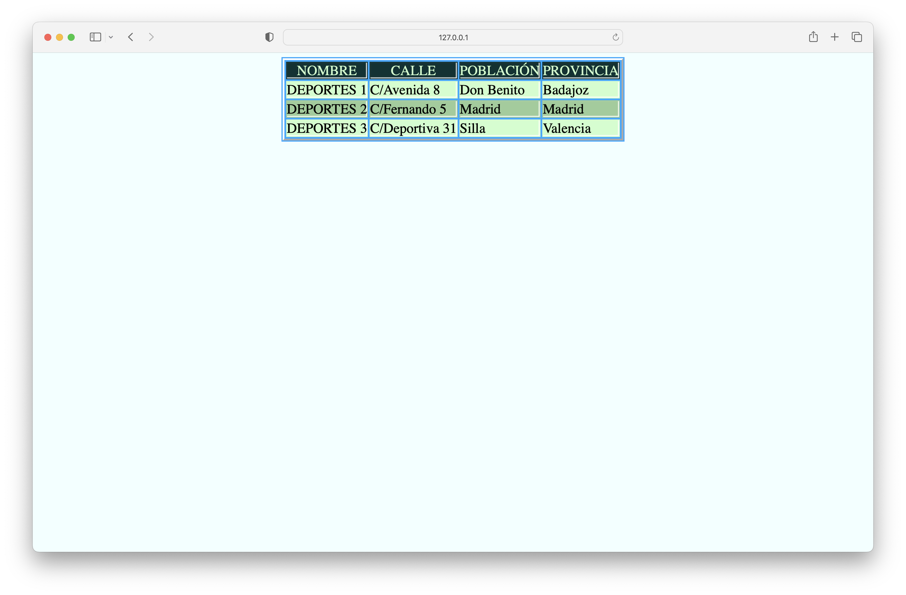
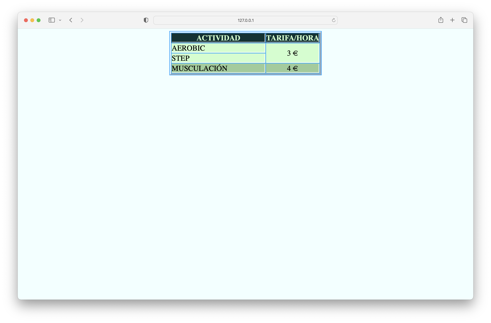
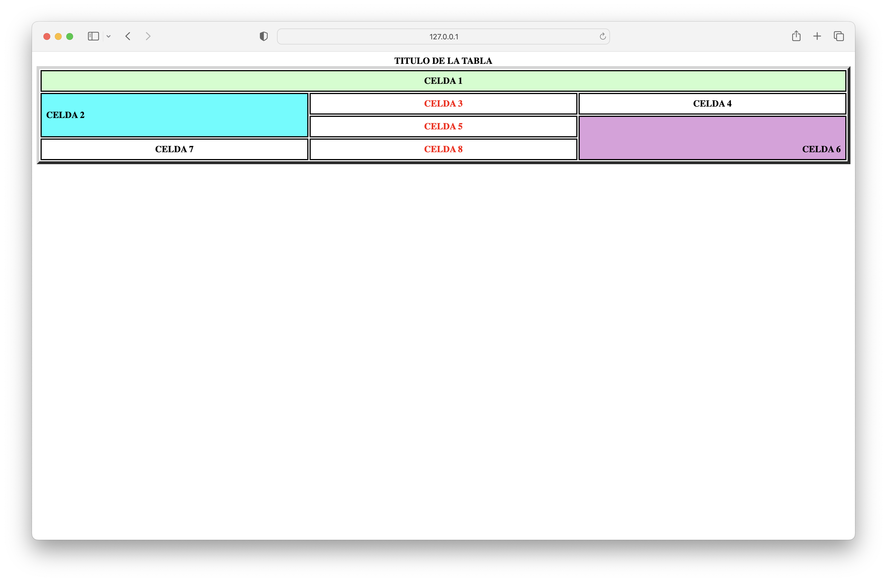
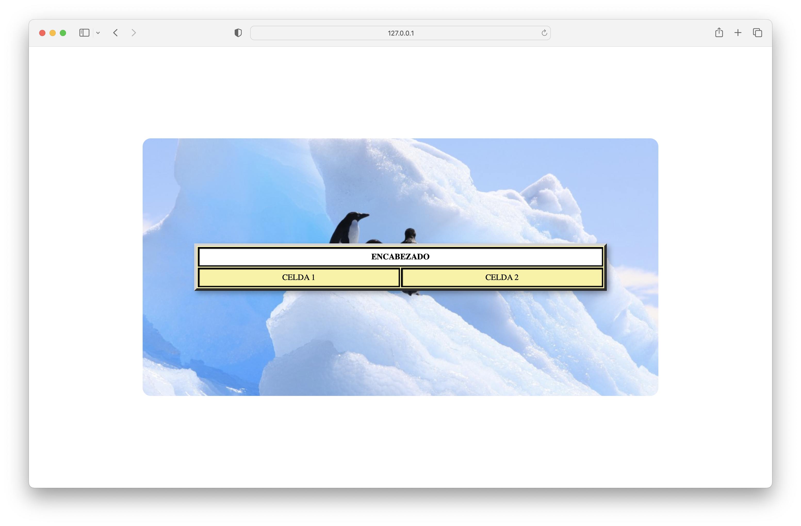
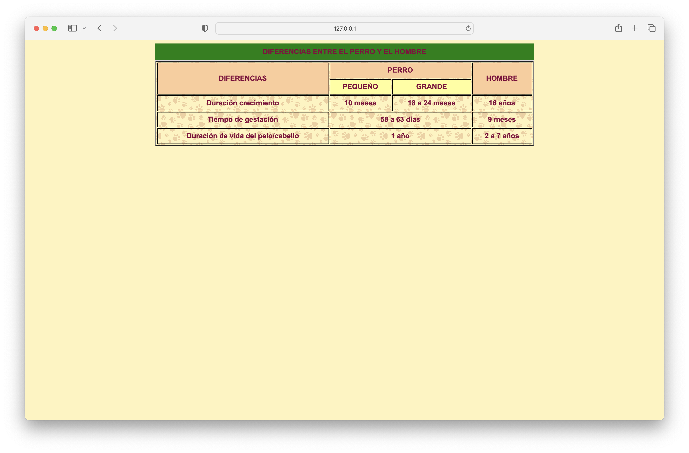
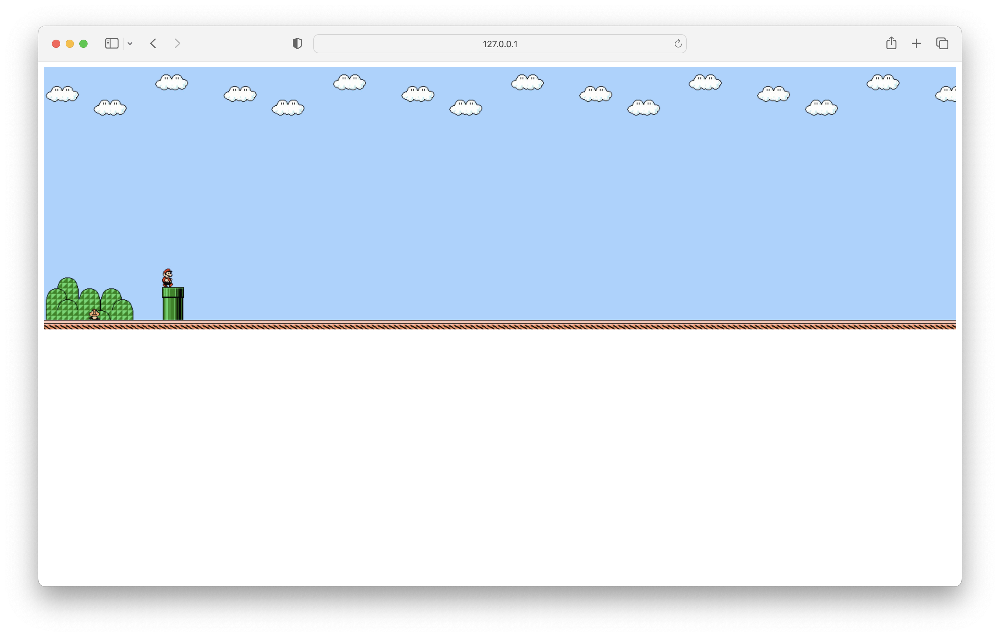
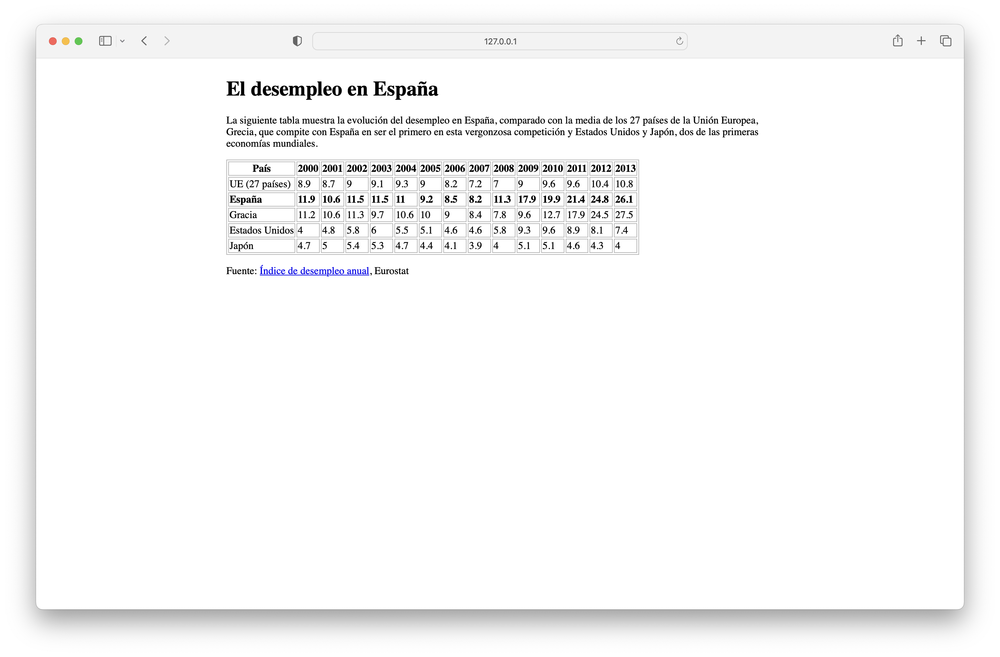
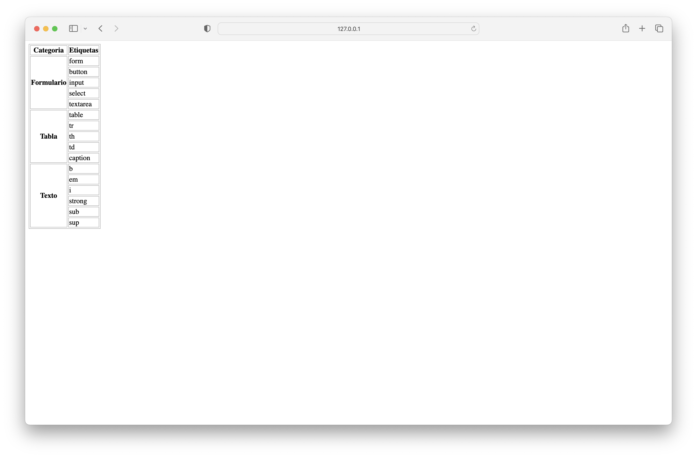

# emm-fe-gc-t04-08-06-23

## Ejercicio 11

[👀 View](https://emagrina.github.io/emm-fe-gc-t04-08-06-23/ejercicio-11/index.html)

## Ejercicio 12

[👀 View](https://emagrina.github.io/emm-fe-gc-t04-08-06-23/ejercicio-12/index.html)

## Ejercicio 13

[👀 View](https://emagrina.github.io/emm-fe-gc-t04-08-06-23/ejercicio-13/index.html)

## Ejercicio 14

[👀 View](https://emagrina.github.io/emm-fe-gc-t04-08-06-23/ejercicio-14/index.html)

## Ejercicio 15

[👀 View](https://emagrina.github.io/emm-fe-gc-t04-08-06-23/ejercicio-15/index.html)

## Ejercicio 16

[👀 View](https://emagrina.github.io/emm-fe-gc-t04-08-06-23/ejercicio-16/index.html)

## Ejercicio 17

[👀 View](https://emagrina.github.io/emm-fe-gc-t04-08-06-23/ejercicio-17/index.html)

## Ejercicio 18

[👀 View](https://emagrina.github.io/emm-fe-gc-t04-08-06-23/ejercicio-18/index.html)

## Ejercicio 19

[👀 View](https://emagrina.github.io/emm-fe-gc-t04-08-06-23/ejercicio-19/index.html)

## Ejercicio 20

[👀 View](https://emagrina.github.io/emm-fe-gc-t04-08-06-23/ejercicio-20/index.html)